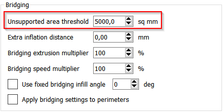
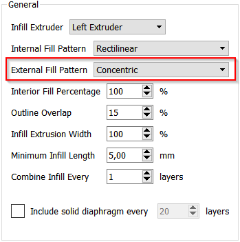
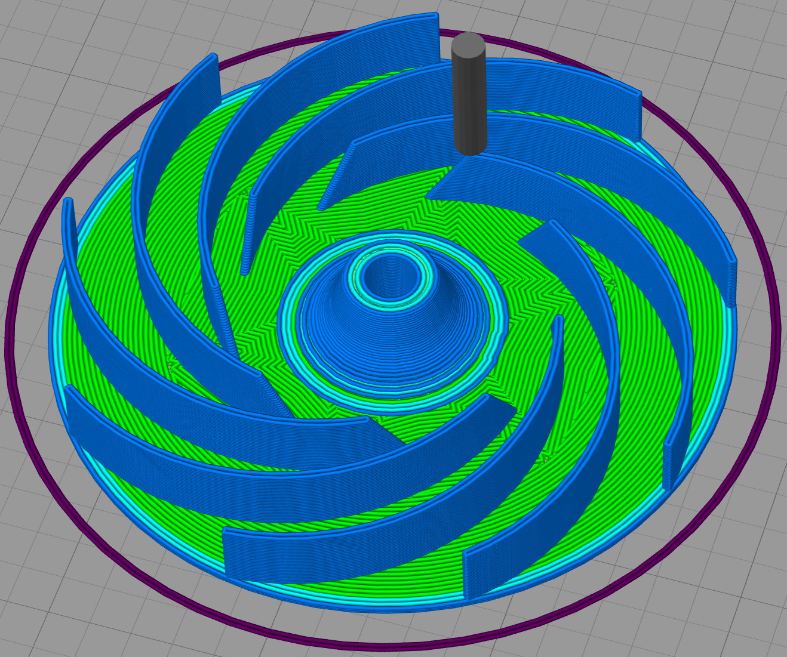
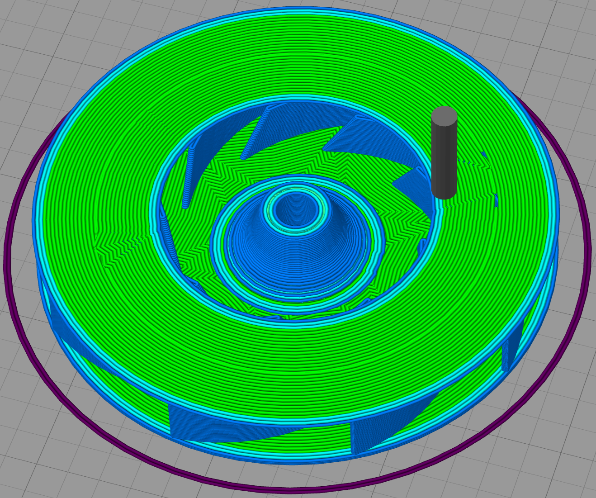

This model is a replacement turbine for an [Electrolux Rapido handheld vacuum cleaner](https://www.electrolux.com.hk/appliances/vacuum-cleaners/zb6114/).

After a few years, my vacuum cleaner started making high pitch noises when I turned it on. After opening it, it turned out that the turbine was starting to break, making it rub against its enclosure and causing the noise. It was clear that the turbine would eventually break completely so I stopped using the it. I tried to find a replacement online, but it was only possible to order the full motor, and they would not deliver it to my country.

![A picture of the broken turbine, along with a ruler to give a sense of size. It consists of nine vertical blades sandwished between two 8cm discs. The height of the blades is around 1cm. The blades are curved towards the center, in counter-clockwise direction, but end before reaching the center, leaving a 4cm hole. The top disc has a hole of the same size to let the air flow. The bottom disc's center raises and has a hole that attachs to the motor. That attachment point is cracked in four directions, which was the cause of the failure.](original.jpg)

I decided to attempt to create a compatible turbing using my 3D printer. By looking at the original turbine, I was able to produce a similar part. I don't know how well it will hold up to repeated use, but we'll see :)

Printing this part is a challenge because the top part rests only on the blades, which do not provide that much support. I don't recommend adding support pillars, though, as they would be difficult to remove, and some leftovers may leave the turbine unbalanced.

I was able to achieve a good result by forcing Simplify3D to consider that the top layer was not unsupported, by setting the "Unsupported area threshold" setting to a large value.

I also configured the external fill pattern to "Concentric" so that the pattern is closer to gave radial symmetry. Ideally I would have wanted concentric circles, or even a continuous spiral, but this seems close enough.

The above settings allow the first top layer to print reasonably well on top of the blades:

| Last turbine layer | First top layer |
|-|-|
|  |  |
