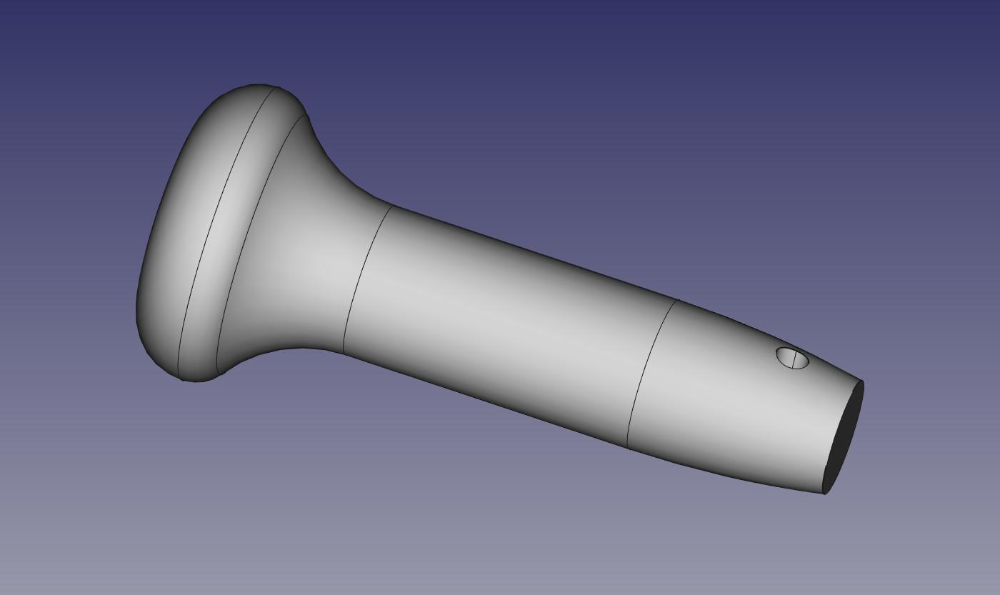
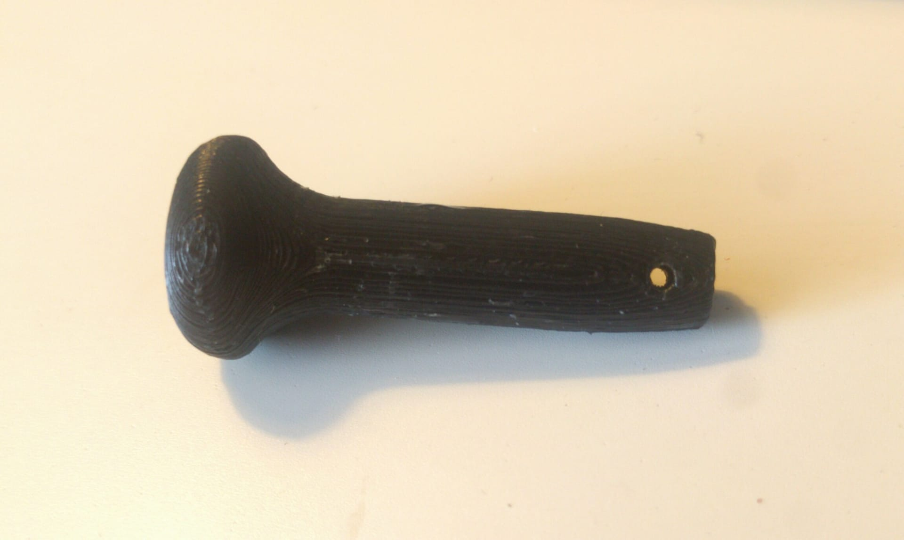

This model is a replacement **rear seat pull rod** for a **Volkswagen Golf 3**.

This is only the top part of the pull rod. The idea is to use nylon wire to pull the seat lever. The part has a hole to attach the wire.

This part should be printed horizontally, with the hole vertical, to maximize the longitudinal strength.

Since it may be difficult to print a rounded part against the bed, a half part is also provided. The idea is to print two halves and glue them together. I printed the halves in black PLA and sued epoxy to glue them together. 

